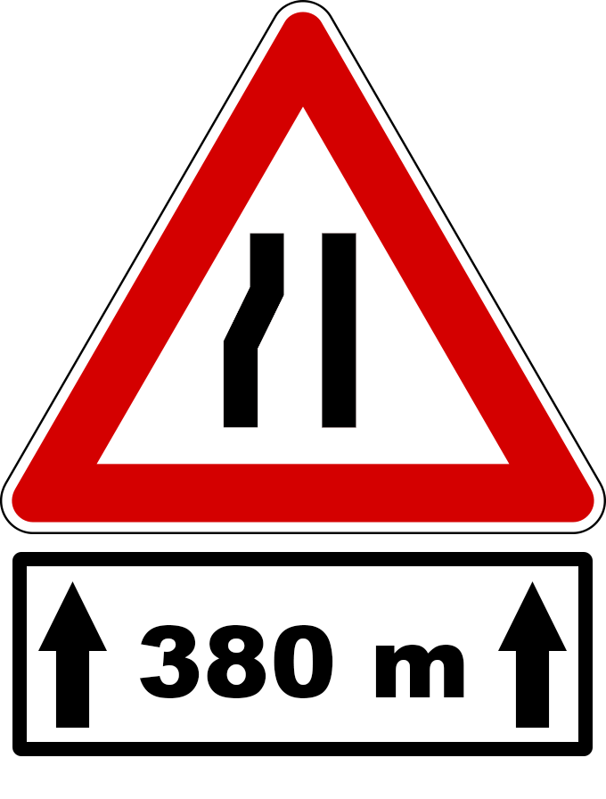
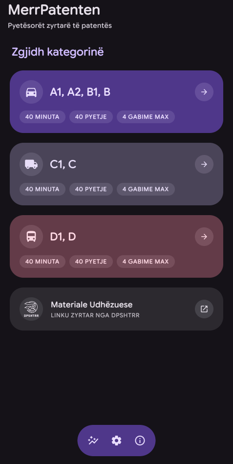
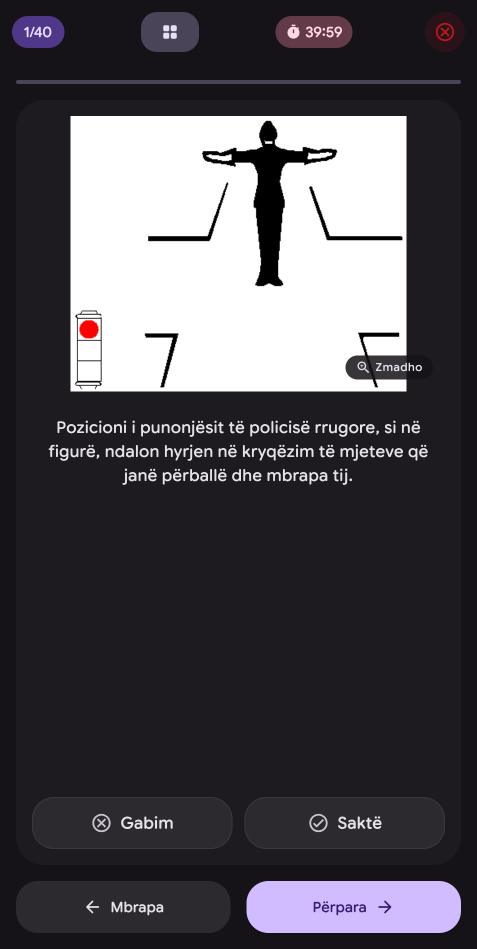
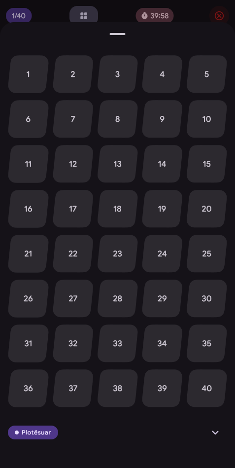
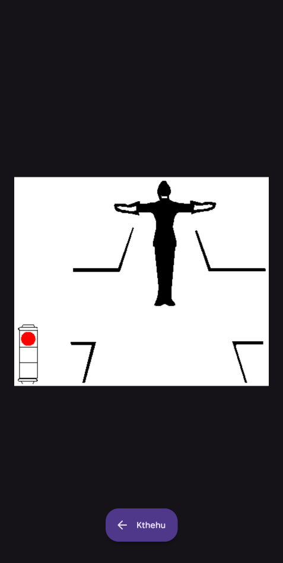
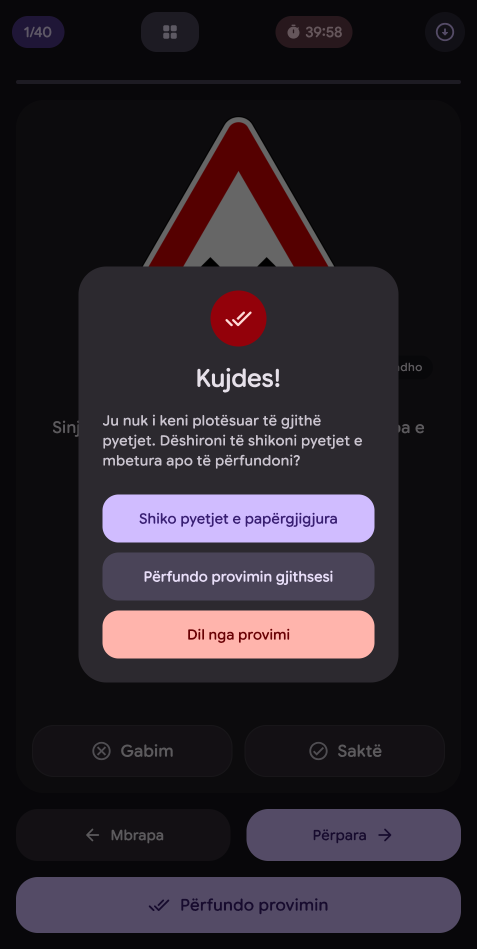
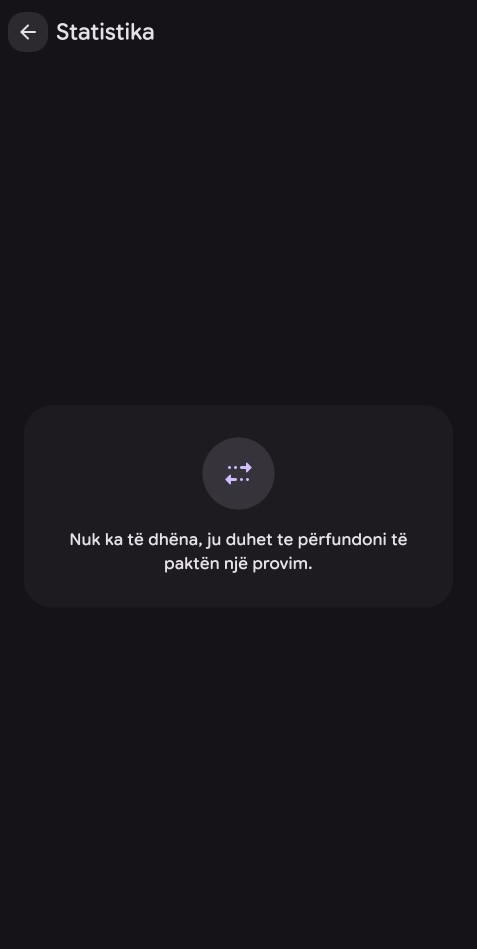
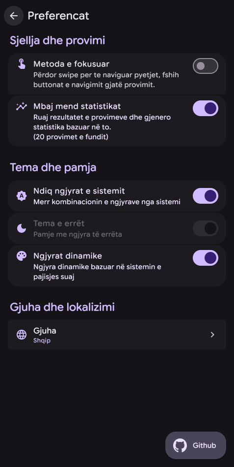
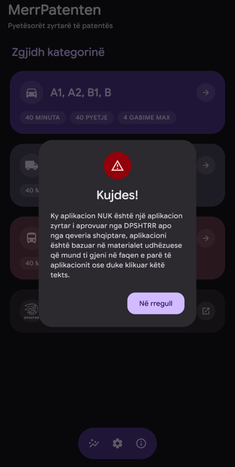

# MerrPatenten 🚗 🇦🇱

<p align="center">
  
</p>

<p align="center">
  <strong>A modern, cross-platform driving license exam simulator for the official Albanian DPSHTRR driving test.</strong>
</p>

<p align="center">
  <a href="https://kotlinlang.org/"></a>
  <a href="https://www.jetbrains.com/lp/compose-multiplatform/"></a>
  <a href="https://m3.material.io/"></a>
  <a href="https://developer.android.com/"></a>
  <a href="https://insert-koin.io/"></a>
  <a href="https://developer.android.com/training/data-storage/room"></a>
  <a href="LICENSE"></a>
</p>

---

## 📱 Showcase

<p align="center">
  <table>
    <tr>
      <td align="center" width="25%">
        <strong>🏠 Dashboard</strong><br/><br/>
        
      </td>
      <td align="center" width="25%">
        <strong>✍️ Exam Simulation</strong><br/><br/>
        
      </td>
      <td align="center" width="25%">
        <strong>🗺️ Question Map</strong><br/><br/>
        
      </td>
      <td align="center" width="25%">
        <strong>🔍 Zoomable Signs</strong><br/><br/>
        
      </td>
    </tr>
    <tr>
      <td align="center" width="25%">
        <strong>📊 Exam Results</strong><br/><br/>
        
      </td>
      <td align="center" width="25%">
        <strong>📈 Statistics</strong><br/><br/>
        
      </td>
      <td align="center" width="25%">
        <strong>⚙️ Preferences</strong><br/><br/>
        
      </td>
      <td align="center" width="25%">
        <strong>ℹ️ Guidelines & Info</strong><br/><br/>
        
      </td>
    </tr>
  </table>
</p>

---

## ✨ Features

- **🇦🇱 Official DPSHTRR Question Bank**: Comprehensive question database for Albanian driving licenses across multiple vehicle categories.
- **🚗 Multi-Category Support**:
  - **Category A1, A2, B1, B**: 40 questions, 40 minutes, maximum 4 errors allowed.
  - **Category C1, C**: Commercial vehicle tests with tailored questions and limits.
  - **Category D1, D**: Passenger transit and heavy transport license questionnaires.
- **⏱️ Realistic Exam Mode**: Real-time countdown timer, dynamic progress tracking, and authentic true/false question flow.
- **🗺️ Interactive Question Map**: Instant grid overview to navigate between answered, unanswered, and flagged questions at any point during the test.
- **🔍 High-Definition Sign Zooming**: Pinch-to-zoom and pan support for inspecting complex road intersection diagrams, traffic police gestures, and road signs.
- **📊 In-Depth Performance Analytics**:
  - Instant score breakdown with pass/fail evaluation upon exam completion.
  - Question-by-question mistake review with correct answer verification.
  - Historical exam logs, score trends, and progress tracking over time.
- **📴 100% Offline-First**: No internet connection required during study or testing. All databases, media assets, and logic run entirely locally.
- **🎨 Material 3 Design & Theming**: Fluid dark/light theme switching with custom accent palettes, sound/haptics toggles, and responsive UI layouts.

---

## 🏗️ Architecture & Tech Stack

**MerrPatenten** is architected using **Kotlin Multiplatform (KMP)** and **Jetpack Compose Multiplatform (CMP)** with clean modularization principles:

```
MerrPatenten
├── androidApp/               # Native Android application target
├── iosApp/                   # iOS SwiftUI application target
├── desktopApp/               # Desktop JVM target with Compose Hot Reload & MCP
│
├── shared-ui/                # Shared Compose UI entry, NavHost & Koin bindings
│
├── shared-feature/           # Isolated feature modules
│   ├── dashboard/            # Category selection, app bar & navigation actions
│   ├── exam/                 # Exam pager, question map, countdown & result sheets
│   ├── statistics/           # Historical test analytics & performance tracking
│   ├── preferences/          # User preferences, themes, audio & app metadata
│   └── image-details/        # Zoomable gestures and traffic sign inspections
│
└── shared-core/              # Foundational domain & data modules
    ├── model/                # Domain models & entities (Question, ExamResult, Category)
    ├── database/             # Room KMP + SQLite Bundled schema & DAOs
    ├── datastore/            # Multiplatform DataStore for user settings
    ├── data/                 # Repositories & data source implementations
    ├── navigation/           # Type-safe Navigation 3 routes & destinations
    └── design-system/        # Material 3 theme, tokens, components & resources
```

### 🛠️ Core Technologies

| Layer / Concern | Technology |
|---|---|
| **Language** | Kotlin 2.4.20-RC (Multiplatform) |
| **UI Toolkit** | Compose Multiplatform 1.12 / Jetpack Compose |
| **Design System** | Compose Material 3 Expressive |
| **Navigation** | Jetpack Navigation 3 Multiplatform (`androidx.navigation3`) |
| **Lifecycle & State** | JetBrains Lifecycle & ViewModel Multiplatform (`androidx.lifecycle`) |
| **Local Database** | Room Multiplatform 2.8 + SQLite Bundled Driver |
| **Key-Value Storage** | AndroidX DataStore Multiplatform 1.2 |
| **Dependency Injection** | Koin 4.2 (Multiplatform BOM + Compose + Navigation3) |
| **Image Loading** | Coil 3.5 (Multiplatform) |
| **Hot Reload & Tooling**| JetBrains Compose Hot Reload + Model Context Protocol (MCP) Server |

---

## 🚀 Getting Started

### Prerequisites

- **JDK 17 or 21+** (e.g. JetBrains Runtime / OpenJDK / Azul Zulu)
- **Android Studio Ladybug | Meerkat** or IntelliJ IDEA with Kotlin & Compose Multiplatform plugins
- **Android SDK** (API 35+)
- **Xcode 16+** (for building and running the iOS target on macOS)

### 📦 Running the Application

#### Desktop (macOS / Linux / Windows)
```bash
# Run the desktop application
./gradlew :desktopApp:run

# Run with Compose Hot Reload enabled
./gradlew :desktopApp:hotRun
```

#### Android
```bash
# Build and install debug APK to connected device/emulator
./gradlew :androidApp:installDebug
```

#### iOS
Open `iosApp/iosApp.xcworkspace` in Xcode, select a simulator or physical iOS device, and press **Run (Cmd + R)**.

---

## 🤖 Compose Hot Reload MCP Server

This repository includes built-in support for the **Model Context Protocol (MCP)** via Compose Hot Reload:

```bash
# Launch the MCP server over stdio for AI agent pairing & live UI inspection
./gradlew --no-daemon --quiet --console=plain :desktopApp:hotMcpServer
```

The MCP server enables external agents and tools to:
- Inspect the live semantic tree (`get_semantic_tree`)
- Interact with UI elements (`click`, `scroll`, `type_text`)
- Check application health & reload state (`status`, `await_reload`)
- Capture live UI snapshots & screenshots (`take_screenshot`)

---

## 📜 Disclaimer

*Ky aplikacion nuk është i lidhur zyrtarisht me Drejtorinë e Përgjithshme të Shërbimeve të Transportit Rrugor (DPSHTRR). Pyetësorët dhe materialet shërbejnë ekskluzivisht për qëllime edukative dhe përgatitore.*

*This application is an educational and preparation tool based on public driving test curricula and is not officially affiliated with DPSHTRR.*

---

## 📄 License

Distributed under the **MIT License**. See `LICENSE` for more information.
